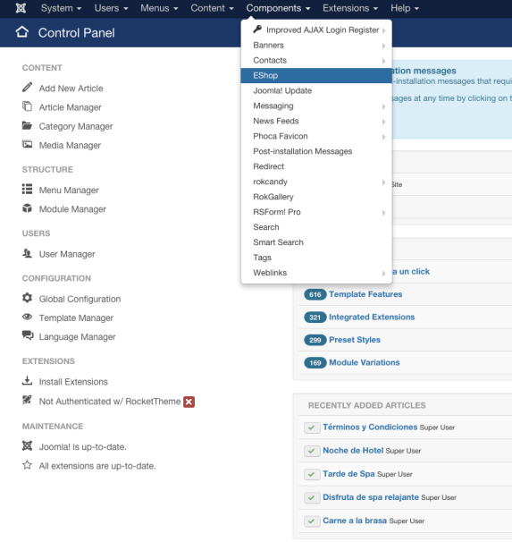
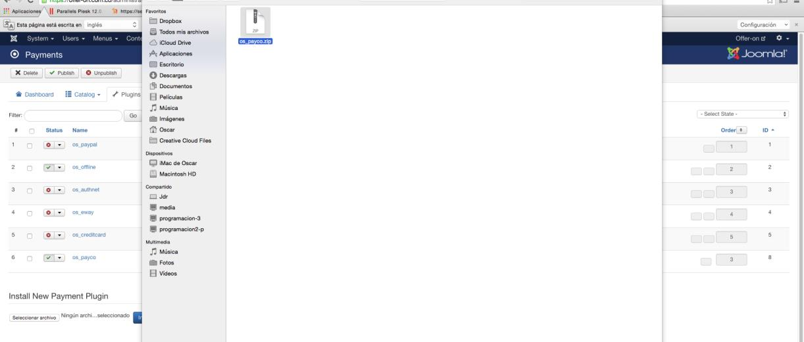
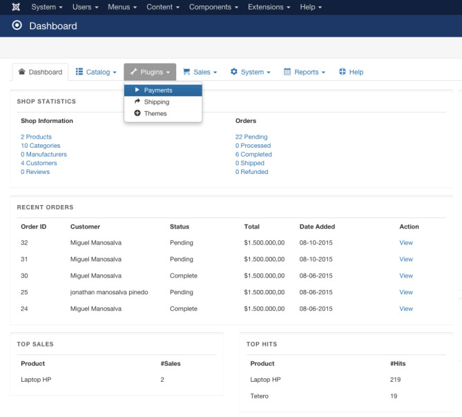
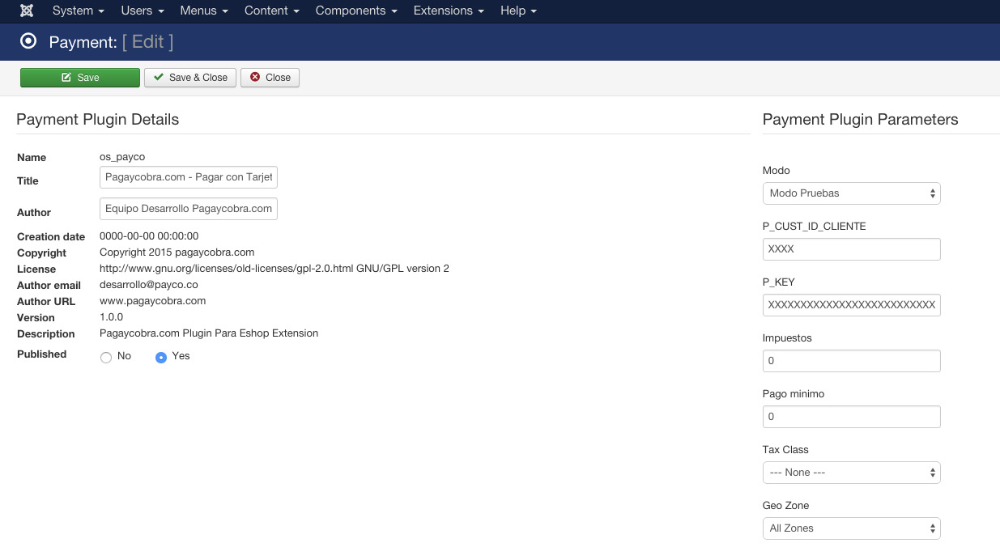

#ePayco plugin para Eshop

**Si usted tiene alguna pregunta o problema, no dude en ponerse en contacto con nuestro soporte técnico: desarrollo@payco.co.**

## Tabla de contenido

* [Requisitos](#requisitos)
* [Instalación](#instalación)
* [Pasos](#pasos)
* [Versiones](#versiones)

## Requisitos

* Tener una cuenta activa en [ePayco](https://pagaycobra.com).
* Tener instalado Joomla y Eshop.
* Acceso a las carpetas donde se encuetra instalado Joomla.
* Acceso a admin de Joomla.

## Instalación

1. [Descarga el plugin.](https://github.com/epayco/Plugin_ePayco_Eshop/releases/tag/1.0.0)
2. Ingresa al administrador de tu Joomla.
3. Ingresa a Plugins /Añadir-Nuevo/Subir-Plugin.
4. Dentro de eshop ubica plugins/payments. En la parte inferior encontraras un título y un botón que dice instalar nuevo plugin de pago Darle clic en subir archivo y buscar el plugin en tu equipo.
5. Después de instalar el .zip lo puedes ver en la lista de plugins instalados.
6. Configura el plugin ingresando el **P_CUST_ID_CLIENTE** y el **P_KEY**, los puedes ver en tu [panel de clientes](https://secure.payco.co/clientes).	
7. Realiza una o varias compras para comprobar que todo esté bien.
8. Si todo está bien recuerda cambiar la **variable Modo Prueba a NO** y empieza a recibir pagos de forma instantánea y segura con ePayco.

## Pasos

## Versiones
* [ePayco plugin Eshop](https://github.com/epayco/Plugin_ePayco_Eshop/releases/tag/1.0.0).